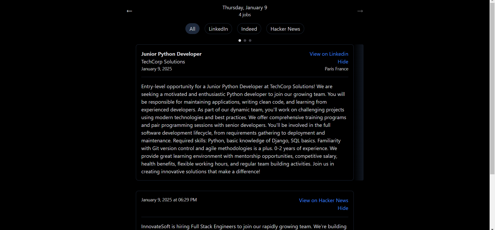

# Daily Job Digest

A job scraping and filtering system that collects software engineering job postings from various sources, filters them based on custom criteria using LLMs, and presents them through a clean web interface.

## Components Overview

The system consists of three main components:

### 1. Job Scraper

The job scraper is responsible for collecting and filtering job postings:
- Supports multiple job sources (LinkedIn,Indeed, Hacker News)
- Uses LLM for job filtering
- Stores results in SQLite database

### 2. API Server
FastAPI-based backend for serving collected jobs:
- Provides RESTful endpoints for job queries
- Enables date-based filtering

### 3. Web UI

Clean and simple interface for browsing jobs:
- Date-based navigation
- Job source filtering
- Groups multiple job postings from the same company



## Setup

1. Install dependencies:
```bash
pip install -r requirements.txt
```

2. Create a `.env` file with the following:
```env
GEMINI_API_KEY=your_gemini_api_key
GOOGLE_API_KEY=your_google_api_key  # For HN search
CSE_ID=your_google_cse_id          # For HN search
```

3. Configure scraping settings in `job_scraper/config.py`:
- Modify `SCRAPERS` list to add/remove job sources
- Adjust filtering criteria in `PROMPTS`

## Usage

### Job Scraper
```bash
python -m job_scraper.main
```

### API Server
```bash
cd api/src
uvicorn daily_job_digest.main:app --reload
```

### Web UI
- Open `web/index.html` in a browser

## Automation

### Windows Task Scheduler

1. Create a new basic task in Task Scheduler
2. Set trigger to run daily at your preferred time
3. Create an action that runs:
   ```batch
   cmd /c "cd /d C:\path\to\project && python -m job_scraper.main"
   ```

## Features

- Multi-source job scraping (Indeed, Hacker News)
- LLM-based job filtering
- Clean web interface with date navigation
- Markdown rendering for job descriptions
- Persistent SQLite storage

## Customization

- Add new job sources by implementing the `JobScraper` base class
- Modify filtering criteria in `config.py`
